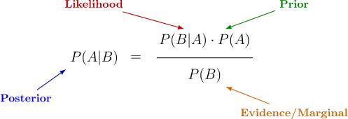
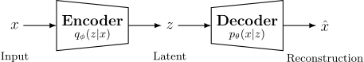

Let's try to derive the loss function of a variational autoencoder.

In a regular autoencoder, we use reconstruction error as the loss function.
But then what? How do we make it variational? And what the hell does variational
even mean? What are all these ELBO, KL Divergence, and other hieroglyphics?

Step by step. Let's see.

## From a conventional autoencoder to a variational one

Here is the diagram of a vanilla autoencoder.

::: {#fig-vae1 style="float: right; margin-right: 20px; margin-bottom: 20px;"}
{fig-alt="VAE diagram"}
:::

The input data $x$ is compressed by the encoder into a latent space $z$, which
the decoder then takes as input to reconstruct $\hat{x}$, using reconstruction
error as the loss function (something like MSE, MAE, whatever we want).

So far, so good. What is the problem? The problem is that who knows what shape
that latent space $z$ will take, because we have no control over it.

Since that latent space may take awkward shapes we would rather not have to deal
with, what we are going to do is map it to a Gaussian distribution. This is what
turns our classical autoencoder into a **variational** one:

$$P(z|x) \sim N(0,1)$$

Now what we want is for the probability of $z$ given $x$ to be as close as
possible to a standard Gaussian distribution (mean 0 and standard deviation 1).

::: {.callout-note collapse="true"}
## Note title (click to expand)

Hidden content goes here.
You can include equations, code, images, etc.
:::

And how do we do this? By adding a second term to the reconstruction-based loss
function we had before.

What we want is a new loss function that penalizes the model if it cannot make
$z$ approximate a Gaussian. There are several ways to do this, apparently, but
the most common one is KL divergence.

So our new and awesome loss function would look like this:

$$
\begin{aligned}
\mathcal{L} &= \mathcal{L}_{\mathrm{reconstruction}} + D_{\mathrm{KL}}
\end{aligned}
$$

## KL Divergence

A divergence is a way to measure the distance between distributions. In other
words: how similar are these two distributions? Very similar? Not at all? Are
they close? Are they far apart? Obviously, if they are close, they are very
similar; if not, they are not.

Mathematically, we measure the distance between two distributions $P$ and $Q$ as:

$$
D_{KL}(P \| Q) = \sum_{x \in \mathrm{X}} p(x) \log \frac{p(x)}{q(x)} \quad \text{or} \quad \int p(x) \log \frac{p(x)}{q(x)} \, dx
$$

The first one is the discrete form and the second one is the continuous form,
but they are equivalent. Sometimes we may also see it expressed in terms of an
expectation. Same thing.

$$
D_{KL}(P \| Q) = \mathbb{E}_{p} \left[ \log \frac{p(x)}{q(x)} \right]
$$

We can also reorganize the terms of the discrete expression to obtain:

$$
D_{KL}(P \| Q) = \underbrace{\sum_{x \in \mathrm{X}} p(x) \log p(x)}_{-H(P) \, \text{Negative Entropy}} - \underbrace{\sum_{x \in \mathrm{X}} p(x) \log q(x)}_{CE(P,Q) \, \text{Negative Cross Entropy}}
$$

This rearrangement does not tell us much right now, but we could rewrite the
divergence as:

$$
D_{KL} = CE(P,Q) - H(P) \Leftrightarrow CE(P,Q) = D_{KL} + H(P)
$$

This identity comes from Shannon's information theory, but that is neither
today's topic nor something that helps us derive and understand variational
inference, so we will leave it in the drawer for another day. For now, we only
need to keep this:

$$
D_{KL}(P \| Q) = \sum_{x \in \mathrm{X}} p(x) \log \frac{p(x)}{q(x)}
$$

Another thing we will need is to understand why $D_{KL} \geq 0$, also known as
**Gibbs' inequality**.

::: {.callout-note collapse="true"}
## Proof: $D_{KL} \geq 0$ (Gibbs' inequality)

**Gibbs' inequality** states that KL divergence is always non-negative:

$$
D_{KL}(P \| Q) \geq 0
$$

Except when $P = Q$, which is when the two distributions are identical and,
therefore, the distance between them is 0. This result is fundamental in
information theory and is named after the physicist Josiah Willard Gibbs. To
prove it, we use **Jensen's inequality**.

### Reminder: Jensen's inequality

Jensen's inequality relates the expected value of a function to the function of
the expected value:

- **Concave function $\rightarrow$ **  $\mathbb{E}[f(X)] \leq f(\mathbb{E}[X])$: For a
concave function, the expected value of the function will always be **less**
than the function of the expected value (e.g. $\log$).
- **Convex function $\rightarrow$ ** $\mathbb{E}[f(X)] \geq f(\mathbb{E}[X])$: For a
convex function, the expected value of the function will always be **greater**
than the function of the expected value (e.g. $x^2$).

{width=100%}

In the plots we have two example values: $x_1$ and $x_2$ (red points on the
curve).

- **Dashed red line**: connects the two red points. It represents what would
happen if we interpolated linearly between $f(x_1)$ and $f(x_2)$.

- **Orange point** $\mathbb{E}[f(X)]$: the average of $f(x_1)$ and $f(x_2)$. Since
averaging is a linear operation, this point lies on the red line.

- **Green point** $f(\mathbb{E}[X])$: first we compute the average of $x_1$ and
$x_2$, and then we evaluate $f$ at that point. That is why it lies directly on
the curve.

For **concave** functions, the curve lies above the red line connecting the
points, so the green point will always be higher than the orange one
($f(\mathbb{E}[X]) \geq \mathbb{E}[f(X)]$). For **convex** functions, the curve
lies below it, so the orange point will always be higher than the green one
($\mathbb{E}[f(X)] \geq f(\mathbb{E}[X])$).

### Proof of Gibbs using Jensen {#gibbs}

Once we understand this, we go back to our definition of KL Divergence:

$$
D_{KL}(P \| Q) = \sum_x p(x) \log \frac{p(x)}{q(x)}
$$

Which we can rewrite by flipping the terms:

$$
 D_{KL}(P \| Q) = -\sum_x p(x) \log \frac{q(x)}{p(x)}
$$

Since $\mathbb{E}[X] = \sum_{x} x \cdot p(x)$, we can rewrite the expression in
terms of an expectation:

$$
 D_{KL}(P \| Q) =  -\mathbb{E}_p\left[\log \frac{q(x)}{p(x)}\right]
$$

And since the logarithm is a **concave** function, we can apply Jensen and say
that the expected value of our function will be less than the function of the
expected value:

$$
 \mathbb{E}_p\left[\log \frac{q(x)}{p(x)}\right] \leq \log \left( \mathbb{E}_p\left[\frac{q(x)}{p(x)}\right] \right)
$$

Now evaluate the expectation on the right-hand side:

$$
\mathbb{E}_p\left[\frac{q(x)}{p(x)}\right] = \sum_x \cancel{p(x)} \frac{q(x)}{\cancel{p(x)}} = \sum_x q(x)
$$

And since the sum of a distribution is 1, we get:

$$
\mathbb{E}_p\left[\frac{q(x)}{p(x)}\right] = \sum_x q(x) = 1
$$

We return to Jensen's inequality with this result:

$$
 \mathbb{E}_p\left[\log \frac{q(x)}{p(x)}\right] \leq \log(1) = 0
$$

Now we substitute this into the expression we had before, the one for KL
Divergence:
$$
  D_{KL}(P \| Q) = -\mathbb{E}_p\left[\log \frac{q(x)}{p(x)}\right] \geq 0
$$

Which is the same as:

$$
  D_{KL}(P \| Q) = \mathbb{E}_p\left[\log \frac{p(x)}{q(x)}\right] \geq  0
$$

And we can rewrite it in the same way we had at the beginning:

$$
  D_{KL}(P \| Q) = \sum_x p(x) \log \frac{p(x)}{q(x)} \geq  0
$$

Ta-da. This is where we wanted to get. We now know that KL divergence must
always be greater than 0:
$$
D_{KL}(P \| Q) \geq 0
$$

This completes the proof of **Gibbs' inequality** using **Jensen's inequality**.
:::

## Variational Inference

We have already learned a few things. Now we need to talk about variational
inference.

A variational autoencoder is nothing more than a way to do variational
inference, which is based on Bayes' rule:

::: {#fig-bayes}
{fig-alt="Bayes rule"}
:::

::: {.callout-note collapse="true"}
## Bayes' rule recap

It is worth briefly reviewing where this thing comes from.

### Joint and conditional probability

Suppose we have some observed data $x$ and some latent variables $z$ that we do
not observe directly. The probability that both occur at the same time is the
**joint probability $p(x,z)$**.

This joint probability can always be factorized using the definition of
**conditional probability**^[The probability that something happens given that
something else has already happened]:

$$p(x,z) = p(z|x) \cdot p(x)$$

Which we can also write as:

$$p(x,z) = p(x|z) \cdot p(z)$$

By setting both expressions equal and solving for $p(z|x)$, Bayes pops out:

$$p(z|x) \cdot p(x) =  p(x|z) \cdot p(z) $$
$$p(z|x)  =  \frac{p(x|z) \cdot p(z)}{p(x)} $$

This is how we get the terms:

* **Posterior $p(z|x)$:** distribution of $z$ after observing $x$. This is what
we want to compute, and it is often described as the "update of our prior
beliefs (prior) after observing the data (likelihood)".
* **Prior $p(z)$:** What we believed about $z$ before observing the data $x$.
This is perhaps the trickiest part. An easy way to get some intuition is to
imagine a six-sided die, where $z$ represents our hypothesis about whether it is
fair or loaded ($z \in \{\text{fair}, \text{loaded}\}$). If I have never rolled
it but I trust it is fair, my prior might be something like
$p(z=\text{fair})=0.9$ and $p(z=\text{loaded})=0.1$.
* **Likelihood $p(x|z)$:** probability^[Strictly speaking, in mathematical terms,
the likelihood is **a function of $z$**, not a probability distribution (it does
not have to sum to 1 over $z$). But for this educational context, calling it a
*probability* is acceptable.] of observing the data $x$ given $z$. It answers
the question: if this value of $z$ were correct, how likely would it be to see
these data $x$? In the die example: if my hypothesis is that the die is fair
($z=\text{fair}$), the probability of rolling a 3 is
$p(x=3|z=\text{fair})=1/6$. If my hypothesis is that it is loaded to roll 6,
then $p(x=3|z=\text{loaded})$ would be much lower.
* **Evidence or Marginal $p(x)$:** Total probability of observing $x$,
considering all possible values of $z$. It is obtained by marginalizing the
joint.

### The problem with the marginal

The evidence $p(x)$ is also known as ***the marginal*** because it is obtained
by **marginalizing**^[Marginalizing = integrating (or summing, in the discrete
case) over all possible values of a variable in order to *eliminate it*] the
joint over $z$.

If we start from the joint probability $p(x,z)$, marginalizing means integrating
over $z$ so that we are left only with the probability of $x$ (we could also do
it the other way around, of course):

$$p(x,z) \rightarrow p(x) = \int{p(x|z)p(z)dz}$$

The problem is that this integral is **intractable**^[It has no analytical
solution or is computationally infeasible to calculate], because it would
require integrating over all possible configurations of $z$, which we do not
know. This is why we cannot calculate $p(x)$ directly in most cases. Because:

* The latent space $z$ may be high-dimensional.
* It has no closed-form analytical solution.
* It grows exponentially with model complexity.

:::

So what Bayes basically does is obtain the posterior. Is that not what our
encoder does? We have some data $x$ and we want to find a latent representation
$z$ that explains them. In other words, we want $p(z|x)$.

Knowing this, we can update our autoencoder diagram in Bayesian terms and say
that:

* The **encoder approximates the posterior**: it computes $q_{\phi}(z|x)$, the
distribution over the latent variables $z$ through the model parameters
${\phi}$ given the observed data $x$.
* The **decoder models the likelihood**: it computes $p_{\theta}(x|z)$, the
distribution over the reconstructed data $\hat{x}$ through the model parameters
${\theta}$ given the latent variable $z$.

::: {#fig-vae2}
{fig-alt="VAE diagram"}
:::

This is interesting. Think of a training set of observed data $x$. We may not
know its distribution $p(x)$, but can we learn a conditional distribution
$p(z|x)$ with which we can map the data $x$ to a known distribution (for example,
a Gaussian? Although we could actually map it to any distribution)?

What we would like is for our encoder to compute the true posterior $p(z|x)$.
But we have already seen that to do that we need the evidence $p(x)$, which we
cannot obtain because it is intractable. So what?

Well, if we cannot compute the exact posterior $p(z|x)$, we approximate it. We
use the distribution $q_{\phi}(z|x)$ computed by our encoder so that it
**resembles as much as possible** the true posterior $p(z|x)$ that we cannot
compute. And that is what variational inference is about:

::: {.callout-important appearance="minimal"}
**Variational inference (VI) is a method for estimating a complex (often
intractable) distribution from a known distribution**.
:::

Different generative models use different tricks to avoid the intractability
problem. We cannot estimate $p(x)$ directly, but can we do it in a slightly
different way? The way a variational autoencoder does it is by using something
known as the Evidence Lower Bound, or ELBO.

## Evidence Lower Bound

This is getting dense.

Quick recap. We now have two things:

* $q_{\phi}(z|x)$: the distribution learned by our encoder.
* $p(z|x)$: our target distribution, the true posterior we care about.

Our goal is to minimize the distance between these two distributions. And how do
we measure that? With **KL Divergence**:

$$D_{KL}(q_{\phi}(z|x)||p(z|x)) = \sum_{z \in \mathrm{Z}} q_{\phi}(z|x) \log\left(\frac{q_{\phi}(z|x)}{p(z|x)}\right)$$

That is, our goal will be to minimize this expression.

Let's manipulate it a bit. We can substitute the posterior in terms of the
joint. Since $p(x,z) = p(z|x) \cdot p(x) \rightarrow p(z|x) = \frac{p(x,z)}{p(x)}$:

$$\sum_{z \in \mathrm{Z}} q_{\phi}(z|x) \log\left(\frac{q_{\phi}(z|x)p(x)}{p(z,x)}\right)$$

Since $\log(a \cdot b) = \log(a) + \log(b)$, we expand:

$$\sum_{z \in \mathrm{Z}} q_{\phi}(z|x) \log\left(\frac{q_{\phi}(z|x)}{p(z,x)}\right)+ \sum_{z \in \mathrm{Z}} q_{\phi}(z|x) \log(p(x))$$

Now we can do two things:

1. The sum in the second term is over $z$, so we can factor out $\log(p(x))$.
2. $q_{\phi}(z|x)$ is a probability distribution over $z$, so
$\sum_{z \in Z} q_{\phi}(z|x) = 1$ by the normalization condition^[A valid
probability distribution must sum to 1 over all its possible values,
$\sum_x p(x) = 1$].

Which leaves us with the expression:

$$\sum_{z \in \mathrm{Z}} q_{\phi}(z|x) \log\left(\frac{q_{\phi}(z|x)}{p(x,z)}\right) + \log(p(x))$$

By [Gibbs' inequality](#gibbs), we know that this whole expression must be
$\geq 0$:

$$\sum_{z \in \mathrm{Z}} q_{\phi}(z|x) \log\left(\frac{q_{\phi}(z|x)}{p(x,z)}\right) + \log(p(x)) \geq 0$$

Or equivalently:

$$ - \sum_{z \in \mathrm{Z}} q_{\phi}(z|x) \log\left(\frac{q_{\phi}(z|x)}{p(x,z)}\right) \leq \log(p(x))$$

Again, using the joint probability $p(x,z) = p(x|z)p(z)$:

$$ - \sum_{z \in \mathrm{Z}} q_{\phi}(z|x) \log\left(\frac{q_{\phi}(z|x)}{p(x|z)p(z)}\right) \leq \log(p(x))$$

And we flip the logarithm to remove the negative sign:

$$
\underbrace{\sum_{z \in \mathrm{Z}} q_{\phi}(z\mid x)\,
\log\left(\frac{p(x\mid z)\,p(z)}{q_{\phi}(z\mid x)}\right)}_{\text{ELBO}}
\;\le\;
\log p(x)
$$

This first term is what is known as the Evidence Lower Bound, or ELBO.

We have reached an expression in which everything is computable or trainable by
a neural network. The term on the right is still intractable, but **we have
found a lower bound**. We have found a function, a formula, that will always be
less than or equal to the logarithm of what we want to calculate.

Therefore, whenever we maximize the ELBO, we are effectively also maximizing
$p(x)$.

:::{.callout-important appearance="neutral"}
# Main takeaway
Since we cannot obtain $p(x)$ directly, we have found an expression that **gives
a lower bound** for $\log p(x)$. As long as we **maximize** that bound (the
ELBO), we will be pushing $\log p(x)$ upward and, in practice, solving the
problem **without having to calculate $p(x)$** explicitly.
:::

## Rewriting ELBO

Now our autoencoder becomes an ELBO maximization problem over the encoder
parameters $\phi$ and the decoder parameters $\theta$. Let's rewrite the ELBO
expression in a way that makes more sense for our neural network:

$$\sum_{z \in \mathrm{Z}} q_{\phi}(z|x) \log\left(\frac{p_{\theta}(x|z)\,p(z)}{q_{\phi}(z|x)}\right)
\;\le\;
\log p(x)
$$

Which we can expand using the product rule for logarithms:

$$\sum_{z \in \mathrm{Z}} q_{\phi}(z|x) \log\left(\frac{p(z)}{q_{\phi}(z|x)}\right)
+ \sum_{z \in \mathrm{Z}} q_{\phi}(z|x) \log(p_{\theta}(x|z))
\;\le\;
\log p(x)
$$

At this point we have two things:

1. The first term has the form of a $D_{KL}$^[Remember that $D_{KL}=\sum_{z}
q_{\phi}(z|x) \log\left(\frac{q_{\phi}(z|x)}{p(z)}\right)$], but with the
fraction inverted: instead of having in the numerator the distribution that is
outside the logarithm in the original expression, over which we are summing, we
have it in the denominator. So we have to flip it and say that we have
$- D_{KL} = - \sum_{z} q_{\phi}(z|x) \log\left(\frac{q_{\phi}(z|x)}{p(z)}\right)$.

2. The second term is the sum of a distribution multiplied by a value. That is
an expectation: $\mathbb{E}[X] = \sum_x x_i P(x_i)$. Making the correspondence
$P(x) \leftrightarrow q_{\phi}(z|x)$ and $X(x) \leftrightarrow
\log(p_{\theta}(x|z))$, we can rewrite it in terms of an expectation:
$\mathbb{E}_{q_{\phi}}[\log(p_{\theta}(x|z))]$.

So we get:

$$-D_{KL}(q_{\phi}(z|x) || p(z)) + \underbrace{\mathbb{E}_{q_{\phi}}[\log(p_{\theta}(x|z))]}_{\text{Log-likelihood}} \leq \log(p(x))$$

This second term starts to look like (***it is***) the ***Log-likelihood*** loss.
Basically, the reconstruction error.

:::{.callout-note}
In practice, the reconstruction term is not computed directly as log-likelihood,
but as MSE. We will see in the next section why they are equivalent under
certain assumptions.
:::

With this, we arrive at the final form of our loss function:

$$-D_{KL} + \text{Reconstruction loss} \leq \log(p(x))$${#eq-kl-def}

## Gaussian case

We could have stopped here, but we want to find the final form of the formula.
What we are going to do now is compute $D_{KL}$ specifically for the Gaussian
case (if we wanted to do this for a non-Gaussian case, we would have to redo
this calculation).

Starting from the equation:

$$D_{KL}(q_{\phi}(z|x) || p(z)) = \sum_{z} q_{\phi}(z|x) \log\left(\frac{q_{\phi}(z|x)}{p(z)}\right)$$

And replacing the distributions $q_{\phi}(z|x)$ and $p(z)$ with their
corresponding analytical Gaussian formulas, we arrive at the following
expression:

$$D_{KL} = \frac{1}{2}\left(\sigma_q^2 + \mu_q^2 - 1 - \log(\sigma_q^2)\right)$$

:::{.callout-note collapse="true"
title="Step by step: $D_{KL}(\mathcal{N}(\mu_q,\sigma_q^2)||\mathcal{N}(0,1))$"
appearance="minimal"}
Our distributions are:

* $q_{\phi}(z|x) \sim N(\mu_q, \sigma_q^2)$: Our posterior distribution predicted by the encoder.
* $p(z) \sim N(\mu_p, \sigma_p^2)$: The standard Gaussian distribution to which we want the latent space $z$ to conform.

The univariate Gaussians of our distributions are:

$$q_{\phi}(z|x) = \frac{1}{\sqrt{2\pi\sigma_q^2}} e^{-\frac{(z-\mu_q)^2}{2\sigma_q^2}}$$

$$p(z) = \frac{1}{\sqrt{2\pi\sigma_p^2}} e^{-\frac{(z-\mu_p)^2}{2\sigma_p^2}}$$

We substitute them into what we have inside the logarithm:

$$D_{KL} = \sum_{z}  q_{\phi}(z|x)\log\left(\frac{\frac{1}{\sqrt{2\pi\sigma_q^2}} e^{-\frac{(z-\mu_q)^2}{2\sigma_q^2}}}{\frac{1}{\sqrt{2\pi\sigma_p^2}} e^{-\frac{(z-\mu_p)^2}{2\sigma_p^2}}}\right)$$

First we simplify the logarithm. We separate the fraction:

$$\log\left(\frac{\frac{1}{\sqrt{2\pi\sigma_q^2}} e^{-\frac{(z-\mu_q)^2}{2\sigma_q^2}}}{\frac{1}{\sqrt{2\pi\sigma_p^2}} e^{-\frac{(z-\mu_p)^2}{2\sigma_p^2}}}\right)$$

This is the same as:

$$\log\left(\frac{\sqrt{2\pi\sigma_p^2}}{\sqrt{2\pi\sigma_q^2}} \cdot \frac{e^{-\frac{(z-\mu_q)^2}{2\sigma_q^2}}}{e^{-\frac{(z-\mu_p)^2}{2\sigma_p^2}}}\right)$$

Simplifying the $\sqrt{2\pi}$ terms and using $\log(ab) = \log(a) + \log(b)$:

$$\log\left(\frac{\sigma_p}{\sigma_q}\right) + \log\left(e^{-\frac{(z-\mu_q)^2}{2\sigma_q^2} + \frac{(z-\mu_p)^2}{2\sigma_p^2}}\right)$$

Since $\log(e^x) = x$:

$$\log\left(\frac{\sigma_p}{\sigma_q}\right) - \frac{(z-\mu_q)^2}{2\sigma_q^2} + \frac{(z-\mu_p)^2}{2\sigma_p^2}$$

Now we substitute this into the full expression for $D_{KL}$:

$$D_{KL} = \sum_{z} q_{\phi}(z|x) \left[\log\left(\frac{\sigma_p}{\sigma_q}\right) - \frac{(z-\mu_q)^2}{2\sigma_q^2} + \frac{(z-\mu_p)^2}{2\sigma_p^2}\right]$$

We distribute the sum:

$$D_{KL} = \sum_{z} q_{\phi}(z|x) \log\left(\frac{\sigma_p}{\sigma_q}\right) - \sum_{z} q_{\phi}(z|x)\frac{(z-\mu_q)^2}{2\sigma_q^2} + \sum_{z} q_{\phi}(z|x)\frac{(z-\mu_p)^2}{2\sigma_p^2}$$

Now we simplify each term:

1. **First term:** $\log(\sigma_p/\sigma_q)$ does not depend on $z$, so it comes out of the sum.
By the normalization condition, $\sum_z q_\phi(z|x) = 1$:

$$\sum_{z} q_{\phi}(z|x) \log\left(\frac{\sigma_p}{\sigma_q}\right) = \log\left(\frac{\sigma_p}{\sigma_q}\right)$$

2. **Second term:** This is the expectation of $(z-\mu_q)^2$ under $q_\phi$, which is the definition of variance:

$$\sum_{z} q_{\phi}(z|x)\frac{(z-\mu_q)^2}{2\sigma_q^2} = \frac{1}{2\sigma_q^2} \mathbb{E}_{q_\phi}[(z-\mu_q)^2] = \frac{\sigma_q^2}{2\sigma_q^2} = \frac{1}{2}$$

3. **Third term:** Using the identity $\mathbb{E}[(z-\mu_p)^2] = \text{Var}(z) + (\mathbb{E}[z] - \mu_p)^2 = \sigma_q^2 + (\mu_q - \mu_p)^2$:

$$\sum_{z} q_{\phi}(z|x)\frac{(z-\mu_p)^2}{2\sigma_p^2} = \frac{\sigma_q^2 + (\mu_q - \mu_p)^2}{2\sigma_p^2}$$

Putting everything together:

$$D_{KL} = \log\left(\frac{\sigma_p}{\sigma_q}\right) - \frac{1}{2} + \frac{\sigma_q^2 + (\mu_q - \mu_p)^2}{2\sigma_p^2}$$

Now we substitute the parameters of the prior $p(z) = \mathcal{N}(0, 1)$, that is, $\mu_p = 0$ and $\sigma_p = 1$:

$$D_{KL} = \log\left(\frac{1}{\sigma_q}\right) - \frac{1}{2} + \frac{\sigma_q^2 + \mu_q^2}{2}$$

Using $\log(1/x) = -\log(x)$:

$$D_{KL} = -\log(\sigma_q) - \frac{1}{2} + \frac{\sigma_q^2 + \mu_q^2}{2}$$

Reordering:

$$D_{KL} = -\log(\sigma_q) + \frac{\sigma_q^2 + \mu_q^2}{2} - \frac{1}{2}$$

Or equivalently:

$$D_{KL} = \frac{1}{2}\left(\sigma_q^2 + \mu_q^2 - 1 - \log(\sigma_q^2)\right)$$

Where $\mu_q$ and $\sigma_q$ are the parameters produced by our encoder for each input $x$.
:::

We substitute into @eq-kl-def:

$$ - \frac{1}{2}\left(\sigma_q^2 + \mu_q^2 - 1 - \log(\sigma_q^2)\right) + \mathbb{E}_{q_{\phi}}[\log(p_{\theta}(x|z))] \leq \log(p(x))$$

This is almost our final loss function. This is the ELBO for the specific
Gaussian case. And our goal is to maximize it. More specifically, our goal is to
maximize it with respect to the parameters $\phi$ and $\theta$ of our neural
network.

$$\max_{\phi,\theta}  - \frac{1}{2}\left(\sigma_q^2 + \mu_q^2 - 1 - \log(\sigma_q^2)\right) + \mathbb{E}_{q_{\phi}}[\log(p_{\theta}(x|z))]$$

But, as we all know, gradient descent does not maximize: it minimizes. So what
we will do is minimize the negative of this function:

$$ \min_{\phi,\theta}  -\left[ - \frac{1}{2}\left(\sigma_q^2 + \mu_q^2 - 1 - \log(\sigma_q^2)\right) + \mathbb{E}_{q_{\phi}}[\log(p_{\theta}(x|z))] \right]$$

Reformulating:

$$ \min_{\phi,\theta}  \frac{1}{2}\left(\sigma_q^2 + \mu_q^2 - 1 - \log(\sigma_q^2)\right) - \mathbb{E}_{q_{\phi}}[\log(p_{\theta}(x|z))]$$

**This is the loss function we are going to implement.**

## References

A quick question to ChatGPT about resources for learning variational inference
will give us this kind of thing:

- Kevin Murphy - "Probabilistic Machine Learning", Volumes 1 and 2. The first one covers probability, Bayes, and graphical models, and the second one goes deeper into VI.
- David Blei, Alp Kucukelbir, Jon McAuliffe (2017) - "Variational Inference: A Review for Statisticians"
- Kingma & Welling (2013) - Auto-Encoding Variational Bayes.
- The classic "Pattern Recognition and Machine Learning" by Bishop.
- McElreath - Statistical Rethinking.

As useful and interesting as they are hard to digest.

I followed this video, which is much clearer:

- [Mathing the Variational AutoEncoder: Deriving the ELBO Loss](https://www.youtube.com/watch?v=jJZadDULoH4). Although the derivation gets a bit out of hand, it is still the clearest resource I have found.
